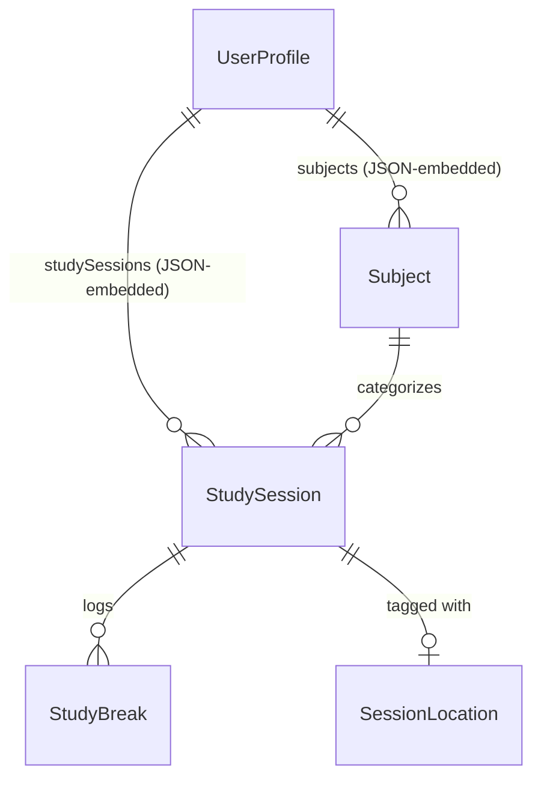
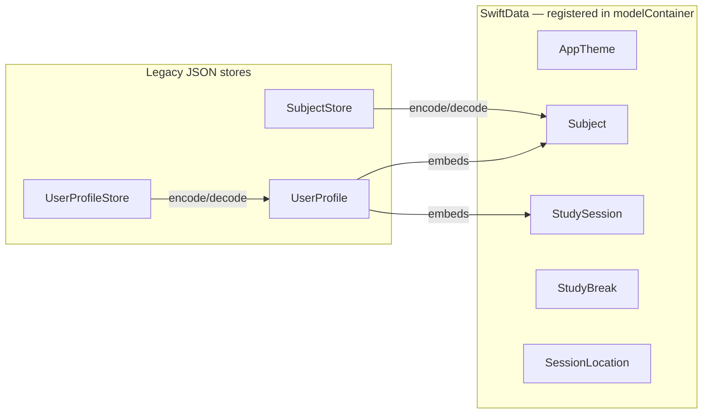

# Models

Reference documentation for StudyApp's data models. Each notable model gets its own page; trivial display-only structs are listed at the bottom instead of given a full writeup.

## Index
| Model | Persistence | Doc |
|-------|-------------|-----|
| `StudySession` | SwiftData | [StudySession/StudySession.md](StudySession/StudySession.md) |
| `StudyBreak` | SwiftData | [StudySession/StudyBreak.md](StudySession/StudyBreak.md) |
| `SessionLocation` | SwiftData | [StudySession/SessionLocation.md](StudySession/SessionLocation.md) |
| `Subject` | SwiftData | [Subject/Subject.md](Subject/Subject.md) |
| `AppTheme` | SwiftData | [AppTheme/AppTheme.md](AppTheme/AppTheme.md) |
| `UserProfile` (+ `AuthState`, `AuthProvider`, `ActiveStatus`) | Legacy JSON store | [UserProfile/UserProfile.md](UserProfile/UserProfile.md) |

## Relationships

`AppTheme` isn't shown above — it has no relationships to the rest of the data model; it's a standalone palette record used only by the Settings UI.

## Persistence layers

StudyApp is mid-migration from manual JSON persistence to SwiftData (see root `CLAUDE.md`). The two paths currently coexist:

`UserProfileStore` and `SubjectStore` both read/write JSON files directly to disk and predate the `@Query`/`ModelContext` pattern used elsewhere. `UserProfile` embedding the SwiftData types `Subject`/`StudySession` is a known gap — see [UserProfile.md](UserProfile/UserProfile.md#swiftdata-relationship).

## Not separately documented
These exist in `Models/` but are thin display structs with no persistence or behavior of their own:
- `SocialFeedItem` (`SocialFeed.swift`) — flat struct of pre-formatted strings for a social feed row.
- `ListItem` (`ListItem.swift`) — field-for-field identical to `SocialFeedItem`; currently unused anywhere in the app.
- `RemoteUser` (`RemoteUser.swift`) — a minimal DTO stub for a future remote backend; not yet referenced by any view or view model.
