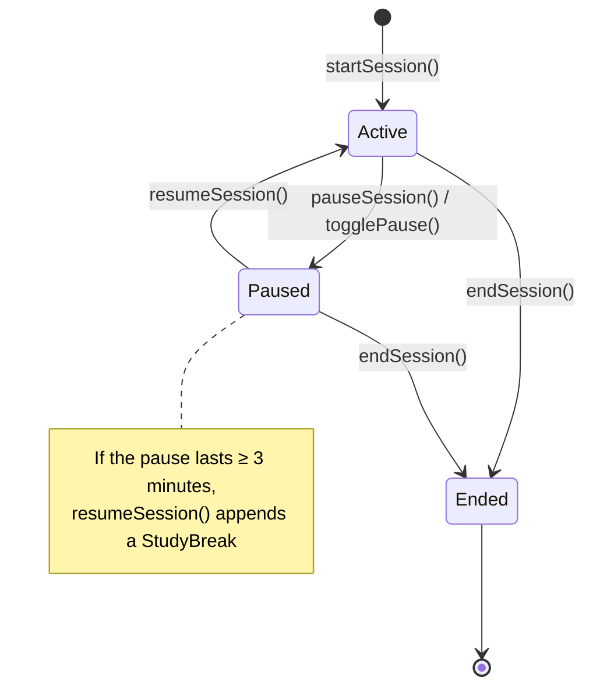

# StudySession

## Overview
`StudySession` is the central SwiftData model in StudyApp. It represents a single study session, from the moment it starts to the moment it's completed, and carries everything the app knows about that session: timing, an optional subject, breaks taken, an optional location, and a post-session score/notes.

## Properties
| Name | Type | Description |
|------|------|-------------|
| `id` | `UUID` | Unique identifier |
| `subject` | `Subject?` | The subject being studied, if any |
| `subjectName` | `String?` | Free-text subject label, used when no `Subject` is linked |
| `startedAt` | `Date` | When the session began |
| `endedAt` | `Date?` | When the session finished; `nil` while still active |
| `lastPausedAt` | `Date?` | Timestamp of the most recent pause |
| `totalActiveDuration` | `TimeInterval` | Computed (read-only). `totalDuration` minus the sum of all `breaks` durations |
| `totalDuration` | `TimeInterval` | Computed (read-only). `endedAt - startedAt`, or `now - startedAt` if still active |
| `totalBreakDuration` | `TimeInterval?` | Stored break time accumulator |
| `breaks` | `[StudyBreak]?` | Break periods logged during the session |
| `friends` | `[String]?` | Placeholder for other users who studied alongside this session |
| `location` | `SessionLocation?` | Where the session took place, if tagged |
| `studyScore` | `Int?` | Optional 0–10 self-rating set at completion |
| `notes` | `String?` | Free-text notes |
| `interruptionCount` | `Int` | Count of interruptions during the session |

### Used Models
- [`StudyBreak`](StudyBreak.md) — one-to-many, via `breaks`
- [`SessionLocation`](SessionLocation.md) — one-to-one, via `location`
- [`Subject`](../Subject/Subject.md) — many-to-one, via `subject`

## Initializers

### Designated Initializer
```swift
init(
    id: UUID = UUID(),
    subject: Subject,
    subjectName: String?,
    startedAt: Date,
    endedAt: Date?,
    lastPausedAt: Date?,
    activeDuration: TimeInterval,
    totalBreakDuration: TimeInterval?,
    breaks: [StudyBreak]?,
    friends: [String] = [],
    location: SessionLocation?,
    studyScore: Int?,
    notes: String?,
    interruptionCount: Int?
)
```
`subject` and `startedAt` are the only values that can't be `nil`/defaulted away; everything else accepts `nil`.

### Convenience Initializer
```swift
convenience init()
```
Builds a session with a temporary placeholder `Subject`, started `now`, and every optional left empty — used as a quick starting point rather than for real session data.

## SwiftData Relationship
- Registered directly in the app's `modelContainer` (see [StudyAppApp.swift](../../../studyApp/App/StudyAppApp.swift)), alongside `Subject`, `StudyBreak`, and `SessionLocation`.
- `subject` links to a `Subject`; deleting a `Subject` does not currently cascade-delete its sessions (no `@Relationship` delete rule is declared).

## Used Flows

### Intended session lifecycle
`StudyTrackingViewModel` (`ViewModels/StudyTrackingViewModel.swift`) drives a session through start → pause/resume → end:



### ⚠️ Known inconsistency
`StudyTrackingViewModel` currently reads/writes session state (`isPaused`, `lastResumedAt`, `companions`, and a mutable `totalActiveDuration`) that doesn't exist on the `StudySession` model above — `totalActiveDuration` is a read-only computed property here, and there's no stored `isPaused`/`lastResumedAt`/`companions`. The view model's calls to `StudySession(...)` and `SessionLocation(...)` also don't match either type's current initializer signatures. This reflects the in-progress SwiftData migration noted in the root `CLAUDE.md` — the lifecycle diagram above describes the *intended* flow, not code that currently compiles against these models.
