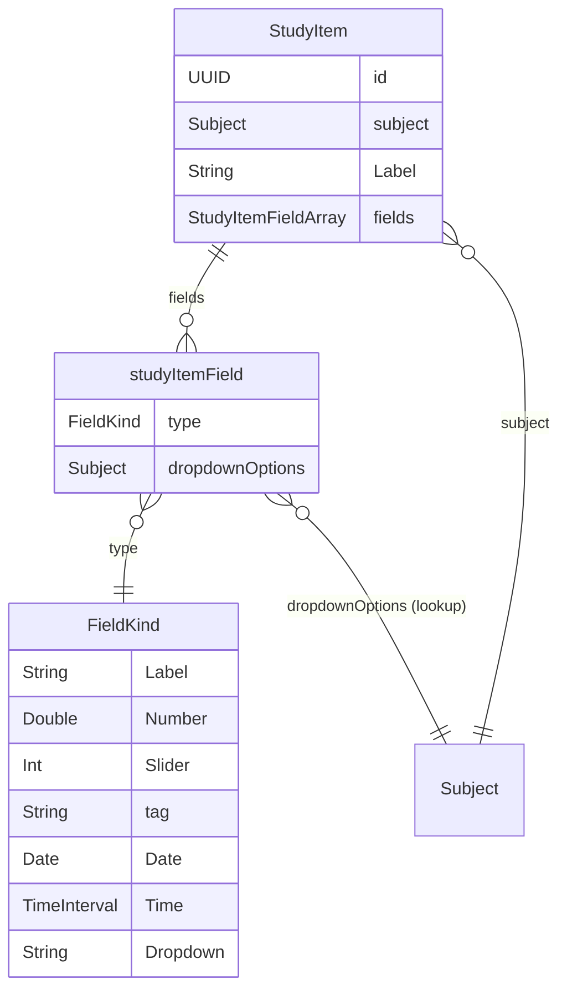

# StudyItem

## Goal
A `StudyItem` is a task belonging to a Subject. It tracks:
- Baseline status (Not Started / In Progress / Completed / On Hold)
- Due date, priority, notes
- Subject-specific tracking fields (slider, tag, weighting, work type, custom status) — *which fields are enabled* and *what they're named* is per-Subject configuration, not per-item

Items persist their values for every possible field type; the UI shows only the fields the Subject has enabled via `SubjectFieldConfig`.

## Core Model
### Base
```swift
StudyItem (@Model) {
  id: UUID                    // unique id + @Unique constraint
  createdAt: Date             // set at init
  updatedAt: Date             // touches on any mutation
  completedAt: Date?          // set when status → Completed
  subject: @Subject           // reference (nullify on subject delete)
  subjectName: String?        // fallback if subject is deleted
  
    //Default fields that are user-configurable
  name: String                // task name

  <!-- status: StudyItemStatus     // global: .notStarted, .inProgress, .completed, .paused -->
  notes: String?              // user notes
  dataFields: [customDataField] // array of custom fields that the user can add; 
}
```

## studyItemField
Tags are global, dropdown are subject-specific.
- Subject will need to be updated with:
- DropdownOptions[String] //dynamic
- defaultStudyItemFields: Array[studyItemField]

```swift
studyItemField (@Model) {
  type: FieldKind(value)       //Enum
  dropdownOptions: @Subject --> //get the options from the subject
}


```

---

## Subject Relationship

```
Subject (@Model)
  @Relationship(deleteRule: .cascade) var fieldConfigs: [SubjectFieldConfig]
  // ... existing properties ...
```

## Ownership & Flow of Control



**Reading the diagram:**
- `StudyItem.fields` owns its `studyItemField`s (one-to-many) — each entry is a configured field on that item.
- Each `studyItemField.type` is a `FieldKind` case carrying its own typed payload (`.slider(Int)`, `.tag(String)`, etc.) — the field's kind and its value are the same property, not a discriminator plus separate value columns.
- `studyItemField.dropdownOptions` isn't stored on the field itself — it's resolved by following the field's `Subject` reference back to that Subject's dropdown option list, so the pool lives once per Subject, not duplicated per item.