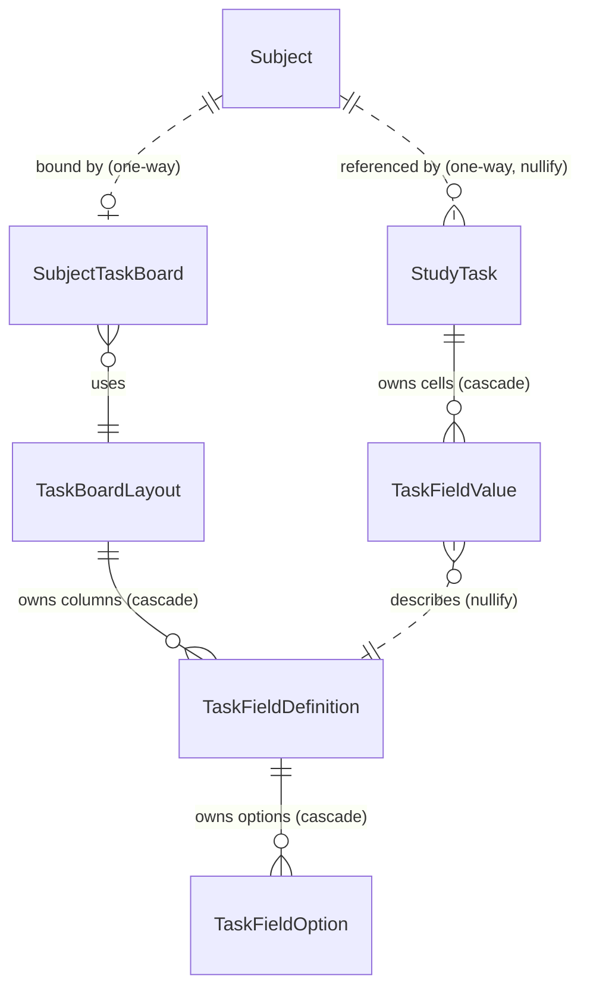
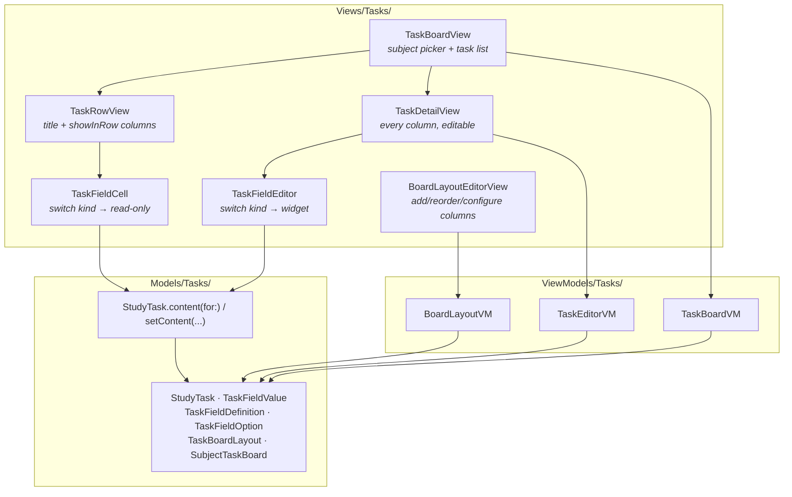

# Study Tasks — Implementation Plan

> **Status: plan only. No code written yet.**
> This document is the design for a task-tracking feature ("study tasks") to sit alongside
> session tracking. It is written against the `swiftdata/session-tracking` branch.

---

## 1. What this is

Today the app answers *"how long did I study?"*. This feature answers *"what do I actually
have to do?"* — a per-subject list of work items with user-configurable columns, in the
spirit of a Monday board or a spreadsheet.

**Example task:** *"Create a data dictionary for tutorial 3"* on subject `INFS2200`, with
columns for due date, work type (`Canvas`), effort (`3/5`), and free-text notes.

The long-term payoff is the link to sessions: pull a handful of tasks into a study session,
tick them off as you go, and get stats back out (time-to-complete, how many sessions a task
took). **That link is designed for here but deliberately not built** — see §9.

### In scope

- A `StudyTask` entity, owned by a subject.
- Seven column types: text, date, checkbox, dropdown, multi-select, number, scale.
- Column layouts that are **named templates** subjects point at, so several subjects can
  share "Default" and one subject can diverge without duplicating everything.
- A self-contained UI: browse a subject's tasks, add/edit a task, edit a layout.

### Out of scope (for now)

| Deferred | Why |
|---|---|
| Image / file columns | By far the most expensive type — external storage, picker integration, thumbnailing, and it complicates any future sync. Its own phase, later. |
| Session ↔ task linking | Designed in §9, built after the board is real. |
| Stats and charts | Needs the link above to exist first. |
| Notifications / reminders | Depends on due dates being trustworthy, which depends on daily use. |
| Any change to the Focus, Social, Groups or Sessions screens | Isolation is the point — see §7. |

---

## 2. The core idea: layout ≠ storage

The one decision everything else follows from:

> **Where a value is stored** and **whether a column is shown** are two different questions.

- **Storage** is a data concern. Some fields are real typed properties on `StudyTask`
  (`title`, `dueDate`, `isDone`). Everything else lives in a generic key-value table.
- **Layout** is a presentation concern. A layout is an ordered list of columns. A column
  points at *either* a core property *or* a custom field definition.

This dissolves the tension between "some fields are universal" and "every subject picks its
own columns". A subject that doesn't care about due dates simply omits the due-date column
from its layout — the property still exists on the row, sitting unused at `nil`. Nothing is
forced onto the screen just because it's typed, and nothing loses type safety just because
it's optional.

It also means the hard-coded core fields keep their advantages — real predicates, real
sorting, compile-time safety, a stable target for the future session link — without
constraining what a board looks like.

---

## 3. Data model

Seven `@Model` types. All new — **no migration needed**, nothing existing changes shape.



Dotted lines are one-way references — the target model has no inverse property and is never
edited. That is what keeps this isolated (§7).

### 3.1 `StudyTask` — the row

```swift
@Model
final class StudyTask {
    var id: UUID
    #Unique<StudyTask>([\.id])

    // --- Core fields: typed because the whole app needs to sort, filter and reason about them ---
    var title: String
    var isDone: Bool
    var completedAt: Date?      // set alongside isDone; gives "time from created to done" for free
    var dueDate: Date?
    var createdAt: Date
    var sortIndex: Int          // manual ordering within a board; drag-to-reorder writes here

    // Mirrors the StudySession pattern: keep the name so history survives subject deletion
    @Relationship(deleteRule: .nullify)
    var subject: Subject?
    var subjectName: String?

    // Custom column values. Cascade — a cell has no meaning without its task.
    @Relationship(deleteRule: .cascade)
    var fieldValues: [TaskFieldValue]?
}
```

**Why exactly these five core fields, and nothing more:**

| Field | Why it earns a typed slot |
|---|---|
| `title` | Every task has one; it's the row label. Nothing works if this is optional. |
| `isDone` / `completedAt` | Drives ticking tasks off during a session, and every future stat. |
| `dueDate` | The one field you'll want to query *across* subjects ("what's due this week"). A generic value can't be sorted efficiently — see §10. |
| `sortIndex` | Manual ordering is table stakes for a board, and it's meaningless as a user-visible column. |
| `subject` | The grouping key. Everything is scoped by it. |

**Deliberately *not* core:** "when I want to work on it". You mentioned it, and the instinct
is to make it core alongside `dueDate` — but the session link in §9 uses an explicit
task↔session join, not a date match. A planning date is a nicety, not a system key, so it
ships as a normal date column in the default layout. If daily use proves it central, promote
it then; it's a small, additive migration.

> **Naming note:** the type is `StudyTask`, never `Task` — `Task` is Swift concurrency's
> type, and shadowing it in a SwiftUI target causes genuinely baffling errors. Supporting
> types take a `Task*` prefix (`TaskFieldValue`, `TaskBoardLayout`), which is unambiguous.

### 3.2 `TaskFieldKind` — the hard-coded catalog

Not persisted as a model; a `String`-backed enum stored on the definition. This is the fixed
menu of types the user picks from when configuring a subject's columns.

| Kind | Config it reads | Value slot used | Renders as |
|---|---|---|---|
| `.text` | — | `textValue` | `TextField` (multi-line for notes) |
| `.date` | — | `dateValue` | `DatePicker` |
| `.checkbox` | — | `boolValue` | `Toggle` |
| `.select` | `options` | `selectedOptions` (one) | Menu / dropdown of coloured pills |
| `.multiSelect` | `options` | `selectedOptions` (many) | Chip grid, tap to toggle |
| `.number` | `unitLabel` | `numberValue` | Numeric `TextField` with unit suffix |
| `.scale` | `scaleMin`, `scaleMax`, `scaleStep` | `numberValue` | `Slider` with tick labels |

`.select` is the dropdown-with-configurable-options you described — "single-select" and
"dropdown" turned out to be the same feature, so they're one kind rather than two.

`.number` vs `.scale` are separate kinds even though both store a `Double`, because their
*configuration* and *editor* differ completely: `.number` is an open-ended count with a
header you name ("Pages", "Weighting"), `.scale` is bounded between two values on a slider.

### 3.3 `TaskFieldDefinition` — the column

```swift
@Model
final class TaskFieldDefinition {
    var id: UUID
    var name: String            // the header: "Pages", "Work type", "Effort"
    var kindRaw: String         // TaskFieldKind
    var coreKeyRaw: String?     // TaskCoreField — nil means this is a custom field
    var sortIndex: Int
    var showInRow: Bool         // surface in the collapsed list row, vs detail-only
    var isRequired: Bool

    // Kind-specific config. Only the slots relevant to `kind` are read; the rest stay at
    // their defaults. Cheaper and far simpler to reason about than a polymorphic config blob.
    var unitLabel: String?
    var scaleMin: Double
    var scaleMax: Double
    var scaleStep: Double

    @Relationship(deleteRule: .cascade)
    var options: [TaskFieldOption]?

    var layout: TaskBoardLayout?    // inverse of TaskBoardLayout.columns
}
```

The `coreKey` slot is the hinge of the hybrid design. A column with
`coreKey = .dueDate, kind = .date` renders with the exact same `DatePicker` as a custom date
column — the only difference is *where the accessor writes*. So:

- **`kind` decides the widget.**
- **`coreKey` decides the destination.**

One switch statement for widgets, used by both core and custom columns. That's what stops
the hybrid from meaning "two parallel UI code paths".

```swift
enum TaskCoreField: String, Codable, CaseIterable {
    case title, dueDate, isDone
}
```

Only three core fields are exposable as columns. `createdAt`, `sortIndex` and `subject` are
machinery, not user columns.

### 3.4 `TaskFieldOption` — a dropdown / tag choice

```swift
@Model
final class TaskFieldOption {
    var id: UUID
    var label: String       // "Canvas", "Physical worksheet", "Code"
    var colorHex: String    // reuses the existing Color(hex:) / toHex() helpers
    var sortIndex: Int
}
```

A model rather than a plain `[String]`, for two reasons that matter in daily use: renaming
"Canvas" to "Blackboard" updates every task at once instead of orphaning old strings, and
each option carries its own colour so statuses read as coloured pills the way they do on a
Monday board. Colour storage reuses `Models/Backend/ThemeColorHex.swift` — no new mechanism.

### 3.5 `TaskFieldValue` — the cell

```swift
@Model
final class TaskFieldValue {
    var id: UUID

    // Nullify: if a column is deleted the cell is orphaned rather than silently dropped,
    // so a mis-click in the layout editor doesn't destroy data. Swept up in §8 Phase 2.
    @Relationship(deleteRule: .nullify)
    var definition: TaskFieldDefinition?

    // Sparse storage — exactly one slot is populated, chosen by the definition's kind.
    var textValue: String?
    var numberValue: Double?
    var dateValue: Date?
    var boolValue: Bool?

    @Relationship(deleteRule: .nullify)
    var selectedOptions: [TaskFieldOption]?

    var task: StudyTask?    // inverse of StudyTask.fieldValues
}
```

Sparse typed columns rather than one `Data` blob. A few empty columns per row cost almost
nothing in SQLite, and in exchange every value stays visible to `#Predicate`, sortable, and
inspectable in the debug views. A Codable blob would be a smaller model and a worse one —
see §10.

### 3.6 `TaskBoardLayout` — the shared template

```swift
@Model
final class TaskBoardLayout {
    var id: UUID
    var name: String        // "Default", "Coding subject", "Reading-heavy"
    var isDefault: Bool     // seeded template, offered to new subjects

    @Relationship(deleteRule: .cascade, inverse: \TaskFieldDefinition.layout)
    var columns: [TaskFieldDefinition]?
}
```

Layouts are shared: edit "Default" once and every subject pointing at it updates. Diverging
is an explicit act — duplicate the layout, rename it, repoint that one subject.

### 3.7 `SubjectTaskBoard` — the binding

```swift
@Model
final class SubjectTaskBoard {
    var id: UUID

    @Relationship(deleteRule: .nullify)
    var subject: Subject?

    @Relationship(deleteRule: .nullify)
    var layout: TaskBoardLayout?

    var createdAt: Date
}
```

This exists **only** so that `Subject.swift` doesn't need a `layout` property. It's the price
of isolation: one extra model and one extra hop, bought in exchange for touching zero
existing model files while `REVIEW_*` branches are in flight.

It also turns out to be the natural home for board-level state you'll want later — saved
sort order, active filters, grouping. If you later decide the coupling is fine, collapse it
into a single `layout` property on `Subject` and delete this model; nothing else changes.

---

## 4. The accessor seam

A generic value model is miserable to use directly from a view. So views never see one.
Everything goes through a single pair of methods, and a transfer enum:

```swift
// Not persisted — the in-memory shape of "whatever is in this cell".
enum TaskFieldContent: Equatable {
    case empty
    case text(String)
    case number(Double)
    case date(Date)
    case flag(Bool)
    case options([TaskFieldOption])
}

extension StudyTask {
    func content(for column: TaskFieldDefinition) -> TaskFieldContent
    func setContent(_ content: TaskFieldContent, for column: TaskFieldDefinition, context: ModelContext)
}
```

`content(for:)` checks `column.coreKey`. If set, it reads the typed property. If nil, it
finds the matching `TaskFieldValue` and unwraps the slot the kind calls for.
`setContent(_:for:context:)` does the reverse, creating the `TaskFieldValue` lazily on first
write so untouched columns never allocate a row.

**This is the only place in the codebase that knows values can live in two places.** Get this
seam right and the rest of the feature is ordinary SwiftUI. Get it wrong and the split leaks
into every view — so it's the first thing to build and the first thing to test.

---

## 5. Component map



### Files

```
studyApp/
├── Models/Tasks/
│   ├── StudyTask.swift
│   ├── TaskFieldKind.swift          # + TaskCoreField + TaskFieldContent
│   ├── TaskFieldDefinition.swift
│   ├── TaskFieldOption.swift
│   ├── TaskFieldValue.swift
│   ├── TaskBoardLayout.swift        # + makeDefault() seed factory
│   ├── SubjectTaskBoard.swift
│   ├── StudyTask+Fields.swift       # the §4 accessor seam
│   └── TaskSchema.swift             # static model list for container registration
├── ViewModels/Tasks/
│   ├── TaskBoardVM.swift            # create/complete/delete/reorder, filter + sort state
│   ├── TaskEditorVM.swift           # single-task form state, validation
│   └── BoardLayoutVM.swift          # column CRUD, option CRUD, layout duplication
└── Views/Tasks/
    ├── TaskBoardView.swift
    ├── TaskRowView.swift
    ├── TaskDetailView.swift
    ├── Fields/
    │   ├── TaskFieldEditor.swift
    │   └── TaskFieldCell.swift
    └── Layout/
        └── BoardLayoutEditorView.swift
```

`studyApp/` is a `PBXFileSystemSynchronizedRootGroup` (Xcode 16, `objectVersion = 77`), so
new files and folders are picked up automatically — **no `.pbxproj` edits, no merge
conflicts from adding files.**

### Adding an eighth column type later

The whole point of the structure. To add, say, a URL column:

1. Add `case url` to `TaskFieldKind`.
2. Add a `case` to `TaskFieldEditor` (the widget).
3. Add a `case` to `TaskFieldCell` (the read-only display).
4. Reuse `textValue`, or add a slot to `TaskFieldValue` if it needs one.

Four touch points, all in the tasks module, none in a view that renders tasks. Nothing else
in the app knows the catalog grew.

---

## 6. Layer conventions

Per `CLAUDE.md`, and matching `SubjectsEditorVM` as the canonical example:

- **Models** — `@Model final class`, defaults on every property, no logic beyond computed
  conveniences. The §4 accessor lives in its own extension file to keep the model
  declarations clean.
- **ViewModels** — `@Observable final class`, no `import SwiftUI`, no stored `ModelContext`.
  Every mutating method takes `context: ModelContext` at the call site.
- **Views** — `@Query` for reads, `@Environment(\.modelContext)` for writes, VMs initialised
  non-optionally as `@State private var vm = TaskBoardVM()`. Previews get
  `.modelContainer(for: TaskSchema.models, inMemory: true)`.

One deviation worth calling out ahead of time: `TaskBoardVM` needs sorting and filtering that
`@Query` can't express (see §10), so it will expose a `func visibleTasks(from:) -> [StudyTask]`
that takes the `@Query` results and returns a sorted/filtered array. The query still lives in
the view; the VM is a pure transform over its output. That keeps the rule intact.

---

## 7. Isolation contract

You asked for this to not depend on anything else so you can wire it in yourself later. Here
is the complete list of what the feature touches outside its own folders:

| File | Change | Why unavoidable |
|---|---|---|
| `App/StudyAppApp.swift` | One array element appended to `.modelContainer(for:)` | SwiftData will not create tables for unregistered models. |
| `Views/Settings/SettingsView.swift` | One `NavigationLink` in the existing Debug section | You need a way to reach the screen. Reverting the feature = deleting one line. |
| `Views/Dev/DebugDataView.swift` | Optional: rows for the new models | Only if you want them in the debug inspector. Purely additive. |

**That's it.** Specifically, the following are *not* touched: `Subject.swift`,
`StudySession.swift`, `StudyTrackingView`, `PureFocusView`, `SessionsView`, `MainTabView`, or
anything under `Views/Social`, `Views/Groups`, `Views/Focus`. No existing model gains a
property, so no `REVIEW_*` branch can conflict with this beyond that one container line.

To keep even that line small, the module owns its own registration list:

```swift
// Models/Tasks/TaskSchema.swift
enum TaskSchema {
    static let models: [any PersistentModel.Type] = [
        StudyTask.self, TaskFieldValue.self, TaskFieldDefinition.self,
        TaskFieldOption.self, TaskBoardLayout.self, SubjectTaskBoard.self
    ]
}

// App/StudyAppApp.swift — the entire diff
.modelContainer(for: [AppTheme.self, /* ...existing... */] + TaskSchema.models)
```

`TaskBoardView` takes an optional subject:

```swift
TaskBoardView(subject: nil)      // standalone — shows its own subject picker
TaskBoardView(subject: subject)  // embedded — scoped, picker hidden
```

So the day you want tasks inside a subject detail screen, it's one initialiser argument, not
a refactor.

---

## 8. Phases

Each phase is independently shippable and independently revertible.

### Phase 0 — Schema and seam, no UI

Build the six models, `TaskSchema`, the `makeDefault()` layout factory, and the §4 accessor.
Register in the container. Add rows to `DebugDataView`. Seed the default layout on first
launch using the existing `.task { ensureDefaultsExist(...) }` pattern.

The default layout seeds as: **Title** (core, text) · **Due date** (core, date) ·
**Status** (select: Not started / In progress / Done / Blocked) · **Work type** (select:
Physical / Canvas / Code / Worksheet / Reading) · **Work on** (date) · **Effort** (scale 1–5) ·
**Notes** (text).

> **Verify:** unit tests over the accessor — write then read each of the seven kinds, confirm
> round-trip equality; confirm a core column writes to the typed property and a custom column
> writes to a `TaskFieldValue`; confirm an untouched column allocates no value row. Then insert
> a task from the debug screen, force-quit, relaunch, confirm it's still there.

The accessor tests are the highest-value tests in the whole feature — they're the one place
where a silent bug corrupts data rather than just looking wrong.

### Phase 1 — Read and write a board

`TaskBoardView` (subject picker + list + add button), `TaskRowView`, `TaskDetailView`,
`TaskFieldEditor` and `TaskFieldCell` for all seven kinds. Layout is fixed to the seeded
default; no layout editing yet.

> **Verify:** create a task on a subject, set a value for each of the seven column types,
> relaunch, confirm all seven survive. Tick a task done and confirm `completedAt` sets.
> Delete a subject and confirm its tasks survive with `subjectName` intact.

At the end of this phase the feature is genuinely usable, with one fixed column set.

### Phase 2 — Layouts

`BoardLayoutEditorView`: add/remove/reorder columns, configure select options and their
colours, set scale bounds and number units. Duplicate a layout. `SubjectTaskBoard` binding UI
so a subject can be pointed at a different layout. Sweep orphaned `TaskFieldValue` rows whose
definition was nullified.

> **Verify:** two subjects on the shared default layout — edit the layout, confirm both update.
> Duplicate it, repoint one subject, edit the copy, confirm the other subject is unaffected.
> Delete a column, confirm no crash and no orphaned rows left behind.

**Checkpoint.** This is the phase where per-subject layouts stop being theoretical. If by the
end of it you're still only using the default layout, that's worth knowing before Phase 3 —
Phases 0–1 remain fully useful on their own, and the machinery is already paid for either way.

### Phase 3 — Board ergonomics

Sort and filter controls, grouping (by status, by due date), drag-to-reorder writing
`sortIndex`, overdue highlighting, a cross-subject "due this week" view.

> **Verify:** each sort/filter combination returns what you'd expect on a board of ~30 tasks
> across 3 subjects.

### Phase 4 — Session linking

See §9. Not built until Phases 0–2 have survived a couple of weeks of real use.

---

## 9. Designed for, not built: the session link

This is the reason the feature is worth building, so the seam is designed now even though the
code comes later. The whole thing is **one new join model** — neither `StudyTask` nor
`StudySession` changes shape, so this stays as isolated as everything above.

```swift
@Model
final class TaskSessionLink {
    var id: UUID

    @Relationship(deleteRule: .nullify) var task: StudyTask?
    @Relationship(deleteRule: .nullify) var session: StudySession?

    var attachedAt: Date
    var completedDuringSession: Bool
    var attributedDuration: TimeInterval   // share of session time credited to this task
}
```

What it unlocks, all derivable from the join plus fields that already exist:

- **"I'm working on these today"** — attach tasks at session start; the focus screen shows
  them as a checklist to pick off. Attaching is a `TaskSessionLink` insert.
- **Time to complete** — sum `attributedDuration` across a task's links.
- **Sessions per task** — `task.links.count`. Both trivially available once links exist.
- **Calendar time to complete** — `completedAt − createdAt`, already on `StudyTask` from
  Phase 0.

`attributedDuration` is the only genuinely fiddly part, and it's a product question rather
than a technical one: if you attach three tasks to a 90-minute session, does each get 30
minutes, or do you track which task was active when? Split-evenly is the honest default and
costs nothing; per-task timing means the session needs a "currently working on" pointer and a
lot more UI. Decide that at Phase 4, not now — nothing above depends on the answer.

---

## 10. Constraints and rejected alternatives

**Sorting by a custom column can't use `@Query`.** SwiftData's `#Predicate` can't sort on a
value reached through a relationship hop *and* selected by kind. Sorting by "Effort" means
fetching the subject's tasks (cheap — tens of rows, not thousands) and sorting in memory in
`TaskBoardVM`. Core fields don't have this problem, which is a large part of why `dueDate`
is core. If a board ever grows past a few hundred tasks this needs revisiting; at university
workload scale it will not.

**Rejected: one Codable blob per task.** A single `Data` column holding all custom values is
a much smaller model. It's also invisible to predicates, opaque in the debug inspector,
needs bespoke migration handling whenever a kind's shape changes, and turns every read into a
decode. Sparse typed slots cost a few nullable columns and are strictly better here.

**Rejected: fully dynamic, everything-is-a-column.** Conceptually cleaner — one mechanism, no
special cases — but it puts `title` behind a generic lookup, makes every view handle "this
board has no title column", and makes the future session link join against untyped values.
The hybrid keeps the universal five honest.

**Rejected: a `layout` property on `Subject`.** The obvious modelling choice, and the right
one *eventually*. Rejected only for now because it means editing a model that live `REVIEW_*`
branches are touching. `SubjectTaskBoard` is the temporary shim, and §3.7 says exactly how to
collapse it when you're ready.

**Orphaned values are a real edge case.** Deleting a column nullifies its cells rather than
cascading, so a mis-click in the layout editor is recoverable. The cost is dead rows until
Phase 2's sweep runs. Worth the trade — the alternative silently destroys data.

**No cross-subject uniqueness on task titles.** Two tasks can share a name. That's correct
(you really do have "read chapter 4" in three subjects) but it means the title alone is never
a valid identifier — always key off `id`.

---

## 11. Documentation conventions while implementing

Per `CLAUDE.md`'s code style — comment the *why*, never the *what*:

- **Every `@Relationship`** gets a one-line comment justifying its delete rule. These are the
  decisions that are invisible at the call site and expensive to get wrong.
- **The §4 accessor** gets a block comment explaining the core/custom split. It's the one
  genuinely non-obvious mechanism in the feature, and the one most likely to confuse you in
  three months.
- **Each `TaskFieldKind` case** gets a trailing comment naming its value slot, so the
  slot↔kind mapping is readable without cross-referencing this document.
- **No docstrings on obvious methods.** `addTask(context:)` explains itself.

This document is the architectural reference and should be updated as phases land — in
particular §8 phase status and any decision in §10 that gets revisited. `docs/AppOverview.md`
gets a Tasks entry once Phase 1 ships.
